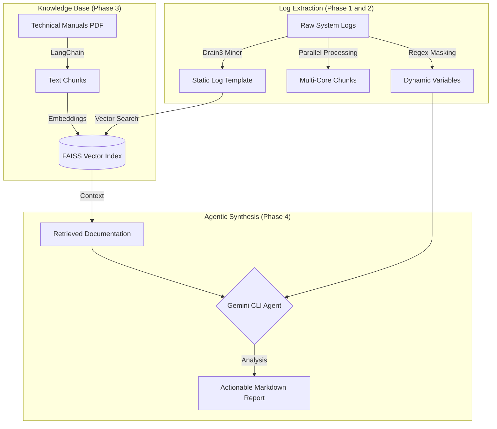

# Agentic RAG Log Triage System

[](https://github.com/google/gemini-cli)
[](https://github.com/logpai/drain3)
[](https://github.com/facebookresearch/faiss)

An automated, production-ready debugging agent designed for high-throughput environments (Semiconductors, Network Infrastructure, Cloud Ops). This system eliminates manual log scrolling by standardizing raw logs, cross-referencing errors against official technical documentation, and generating verifiable root-cause reports.

---

## Architecture Overview

Our goal is to create a deterministic pipeline that bridges the gap between unstructured telemetry and structured technical knowledge.



---

## Core AI Concepts: The Why

### 1. Template Mining (Drain3)
Standard RegEx is brittle and fails in high-throughput environments where log formats change frequently. We use Drain3, an online log parsing approach using a fixed-depth tree. It automatically discovers the skeleton (template) of a log message while masking dynamic variables (IPs, Hex codes, IDs).
* Why? It turns millions of noisy log lines into a few dozen unique event types, making downstream analysis 100x faster.

### 2. Intelligent Parallelism
For massive log files (80GB+), traditional file loading will crash a system. Our parser implements resource-aware multiprocessing. It partitions files into byte-offset chunks and processes them across all available CPU cores.
* Why? This ensures 100% coverage of proprietary logs at maximum hardware speed while maintaining a constant memory footprint (less than 100MB usage).

### 3. Retrieval-Augmented Generation (RAG)
LLMs are prone to hallucinations (making up technical fixes that don't exist). We use RAG to ground the AI in reality. By storing official technical manuals in a FAISS Vector Database, we force the AI to only suggest fixes found in the actual documentation.
* Why? High-stakes environments require verifiable fixes, not creative guesses.

---

## Installation and Setup

```bash
# Clone the repository
git clone https://github.com/chinmayrozekar/Log_Parsing_Tool.git
cd Log_Parsing_Tool

# Setup Virtual Environment
python3 -m venv .venv
source .venv/bin/activate
pip install -r requirements.txt
export PYTHONPATH=$PYTHONPATH:.
```

---

## Usage Examples

### 1. Generate Realistic Test Data
Generate high-fidelity industrial logs for testing (EDA simulations or SLT Benchmarks).
```bash
# Generate 60MB Hierarchical PERC DRC Log
python3 src/eda_log_generator.py

# Generate 100MB SLT CPU/GPU/Peripheral Benchmark Log
python3 src/slt_log_generator.py
```

### 2. Intelligent Triage and Parsing
Run the parallel Drain3 miner to identify unique log signatures with severity filtering and density ranking.
```bash
# Parse only CRITICAL failures from a 100MB SLT log
python3 src/main.py parse --file data/raw_logs/slt_benchmark_100mb.log --severity CRITICAL

# Parse all ERROR and WARNING trends from an EDA log
python3 src/main.py parse --file data/raw_logs/perc_drc_hierarchical.log --severity ERROR,WARNING
```

### 3. Ingest Technical Manuals
Process PDF manuals into searchable semantic chunks stored in FAISS.
```bash
python3 src/main.py ingest --file docs/manuals/yosys_manual.pdf
```

---

## Roadmap

- [x] Phase 1: Log Extraction (Drain3 Implementation, Template Discovery)
- [x] Phase 2: High-Performance Triage (Resource-Aware Parallelism, Severity Filtering, Density Ranking)
- [x] Phase 3: Knowledge Ingestion (PDF Loader, FAISS Vector Index integration)
- [ ] Phase 4: Agentic Synthesis (Gemini CLI integration for automated report generation)
- [ ] Phase 5: Deployment (PyInstaller Binary for standalone terminal usage)

---

## Acknowledgments

This project was built and architected in collaboration with Google Gemini CLI. The entire development lifecycle (from environment setup to the implementation of the multi-core parser and this documentation) was assisted by Generative AI to ensure production-grade standards and idiomatic Python patterns.

---

**Author:** [Chinmay Rozekar]  
**Objective:** Transforming raw telemetry into actionable engineering intelligence.
