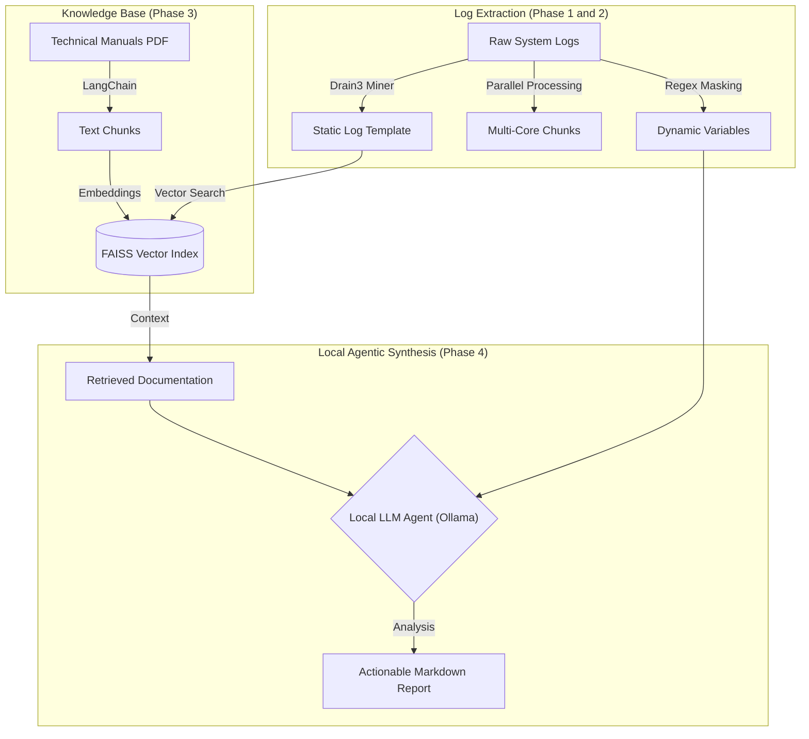

# SiliconSentry: Agentic RAG Log Triage System

[](https://ollama.com/)
[](https://github.com/logpai/drain3)
[](https://github.com/facebookresearch/faiss)

SiliconSentry is an automated, production-ready debugging agent designed for high-throughput environments (Semiconductors, Network Infrastructure, Cloud Ops). This system eliminates manual log scrolling by standardizing raw logs, cross-references errors against official technical documentation, and generates verifiable root-cause reports.

**Note: This system runs 100% locally for maximum data sovereignty and zero latency.**

---

## Architecture Overview

Our goal is to create a deterministic pipeline that bridges the gap between unstructured telemetry and structured technical knowledge.



---

## Core AI Concepts: The Why

### 1. Template Mining (Drain3)
Standard RegEx is brittle and fails in high-throughput environments where log formats change frequently. We use Drain3, an online log parsing approach using a fixed-depth tree. It automatically discovers the skeleton (template) of a log message while masking dynamic variables (IPs, Hex codes, IDs).
* Why? It turns millions of noisy log lines into a few dozen unique event types, making downstream analysis 100x faster.

### 2. Intelligent Parallelism
For massive log files (80GB+), traditional file loading will crash a system. Our parser implements resource-aware multiprocessing. It partitions files into byte-offset chunks and processes them across all available CPU cores.
* Why? This ensures 100% coverage of proprietary logs at maximum hardware speed while maintaining a constant memory footprint (less than 100MB usage).

### 3. Local Retrieval-Augmented Generation (RAG)
LLMs are prone to hallucinations (making up technical fixes that don't exist). We use RAG to ground the AI in reality. By storing official technical manuals in a FAISS Vector Database, we force the AI to only suggest fixes found in the actual documentation.
* Why? High-stakes environments (like semiconductor testing) require verifiable fixes, not creative guesses.

### 4. Sovereign AI Agent
The final layer uses a local AI Agent (via Ollama) to act as a Senior Systems Engineer. It takes the discovered patterns, matches them against the RAG context, and synthesizes a professional engineering report.
* Why? Because proprietary logs never leave the local machine, ensuring 100% data privacy and zero dependency on cloud APIs.

---

## Installation and Execution

### Prerequisites
Install [Ollama](https://ollama.com/) and pull the required model:
```bash
ollama pull qwen2.5-coder:7b
```

### Option 1: Standalone Binary (Fastest)
Download the `SiliconSentry` folder and run the executable directly from your terminal. No Python installation is required.

```bash
# Run the tool (Instant Start)
./SiliconSentry/SiliconSentry --help
```

### Option 2: Development Setup (Source)
```bash
# Clone and Setup
git clone https://github.com/chinmayrozekar/SiliconSentry_Agentic_RAG_Log_Triage_System.git
cd SiliconSentry_Agentic_RAG_Log_Triage_System
python3 -m venv .venv
source .venv/bin/activate
pip install -r requirements.txt
export PYTHONPATH=$PYTHONPATH:.
```

---

## Usage Examples

### 1. Ingest Technical Manuals
Process a PDF manual into searchable semantic chunks stored in FAISS.
```bash
python3 src/main.py ingest --file docs/manuals/yosys_manual.pdf
```

### 2. Generate Realistic Test Data
```bash
# Generate 60MB Hierarchical PERC DRC Log
python3 src/eda_log_generator.py

# Generate 100MB SLT Benchmark Log
python3 src/slt_log_generator.py
```

### 3. Intelligent Triage and Parsing
Run the parallel Drain3 miner to identify unique log signatures with severity filtering and density ranking.
```bash
# Parse only CRITICAL failures from a 100MB SLT log
python3 src/main.py parse --file data/raw_logs/slt_benchmark_100mb.log --severity CRITICAL
```

### 4. Full Autonomous Analysis (Local Agent)
Run the end-to-end pipeline to generate a professional triage report using local Ollama.
```bash
python3 src/main.py analyze --file data/raw_logs/perc_drc_hierarchical.log
```

---

## Building the Binary
To compile the source code into a high-performance directory distribution:
```bash
pip install pyinstaller
pyinstaller --noconfirm --onedir --console --add-data "drain3.ini:." --hidden-import charset_normalizer --name SiliconSentry src/main.py
```

---

## Acknowledgments

This project was built and architected in collaboration with Generative AI to ensure production-grade standards and idiomatic Python patterns.

---

**Author:** [Chinmay Rozekar]  
**Objective:** Transforming raw telemetry into actionable engineering intelligence.
